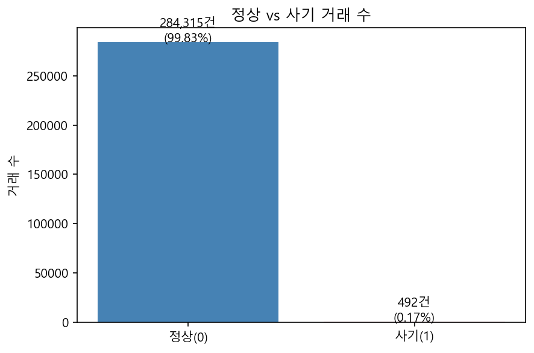
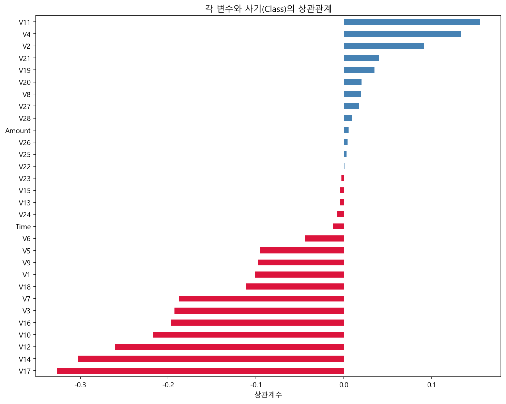
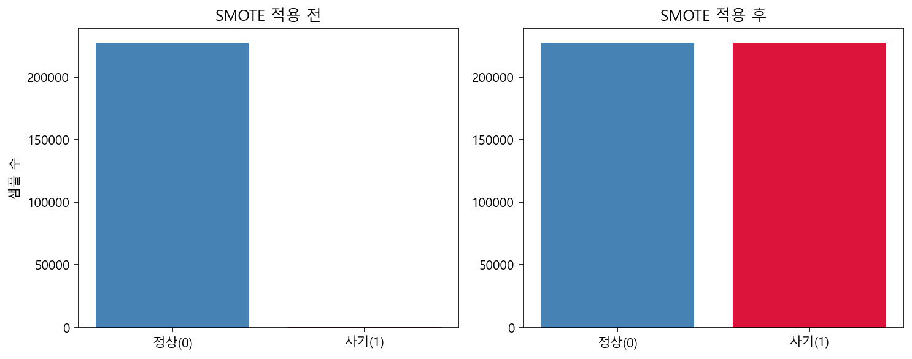
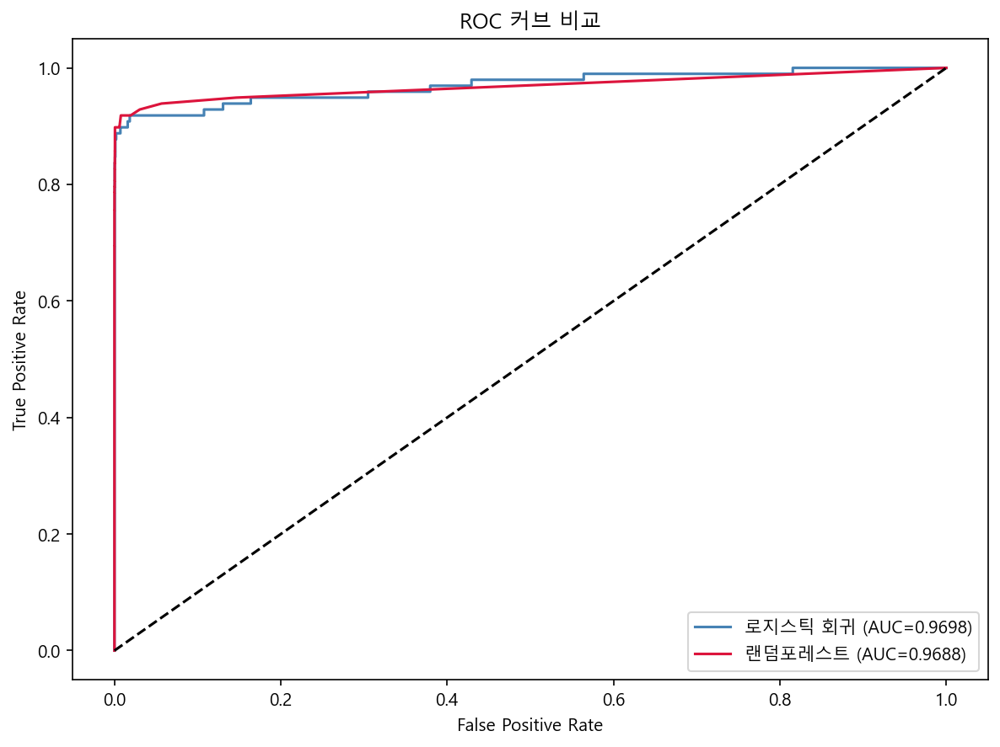
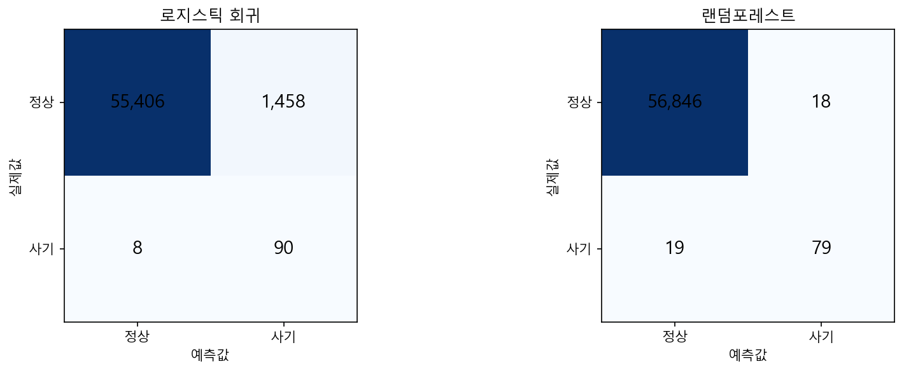

# 💳 신용카드 사기 탐지 분석
> Credit Card Fraud Detection using SMOTE & Machine Learning

## 📌 프로젝트 개요
실제 신용카드 거래 데이터(284,807건)를 활용하여 사기 거래를 탐지하는 머신러닝 모델을 개발했습니다.
전체 거래 중 사기 비율이 0.17%에 불과한 극심한 **클래스 불균형 문제**를 SMOTE로 해결하고,
두 가지 모델을 비교하여 은행 실무에 적합한 모델을 선정했습니다.

## 📊 데이터
- 출처: [Kaggle - Credit Card Fraud Detection](https://www.kaggle.com/datasets/mlg-ulb/creditcardfraud)
- 전체 거래: 284,807건
- 사기 거래: 492건 (0.17%)
- 특성: V1~V28 (PCA 변환), Amount, Time

## 🔍 분석 과정

### 1단계: 탐색적 데이터 분석 (EDA)
- 클래스 불균형 확인 (정상 99.83% vs 사기 0.17%)
- 거래 금액 및 시간대별 분포 분석
- 각 변수와 사기 여부의 상관관계 분석

### 2단계: 전처리
- Amount, Time 변수 StandardScaler 정규화
- SMOTE를 활용한 클래스 불균형 해소

### 3단계: 모델링 & 비교

| 모델 | ROC-AUC | 사기 탐지(Recall) | 오탐(FP) |
|------|---------|-----------------|---------|
| 로지스틱 회귀 | 0.9698 | 90/98건 | 1,458건 |
| 랜덤포레스트 | 0.9688 | 79/98건 | 18건 |

## 💡 결론
- 로지스틱 회귀는 사기를 더 많이 잡지만 오탐(False Positive)이 많아 고객 불편 초래
- 랜덤포레스트는 오탐이 18건으로 현저히 적어 고객 경험 측면에서 우수
- **은행 실무에서는 고객 불편을 최소화하는 랜덤포레스트가 더 적합**

## 🛠 사용 기술
`Python` `Pandas` `Scikit-learn` `imbalanced-learn` `Matplotlib` `Seaborn`
